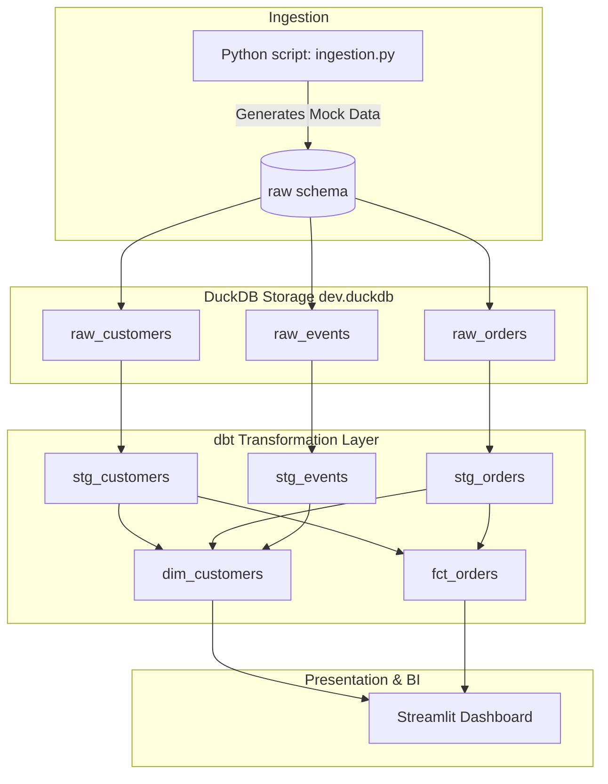

# Modern E-Commerce Data Warehouse (DWH) with CI/CD

A modern, local Data Warehouse (DWH) designed using **DuckDB** and **Streamlit** with full CI/CD automation.

---

## Architecture Design



---

## Technology Stack & Components

1. **Analytical Engine**: **DuckDB** (`data/dev.duckdb`) is used as a fast, serverless local database for modeling.
2. **Data Transformation**: **dbt** compiles SQL queries into physical tables or views in the DuckDB database.
3. **Ingestion & Data Generation**: `src/ingestion.py` generates synthetic, clean transaction logs, customers, and events, loading them to DuckDB.
4. **Data Visualization (BI)**: A beautiful, responsive **Streamlit** dashboard displays key KPIs (Revenue, AOV, Order Status, Top Spenders) using Plotly charts.
5. **Quality & Formatting**: `sqlfluff` is integrated to enforce SQL syntax styling and code formatting rules.
6. **CI/CD**: GitHub Actions workflow (.github/workflows/ci.yml) triggers on every push/PR to validate SQL linting, run data ingestion, and run `dbt build` (compilation + testing).

---

## Local Setup Instructions

### Prerequisites
- Python 3.10+ (tested on Python 3.14)
- Git

### 1. Clone & Set Up Virtual Environment
```bash
# Clone the repository
git clone <your-repository-url>
cd DWH

# Create a virtual environment
python -m venv .venv

# Activate virtual environment
# On Windows (PowerShell):
.venv\Scripts\Activate.ps1
# On macOS/Linux:
source .venv/bin/activate
```

### 2. Install Dependencies
```bash
pip install -r requirements.txt
```

### 3. Run Ingestion (Populate raw data)
This generates the e-commerce mock dataset and populates the `raw` schema inside `data/dev.duckdb`.
```bash
python src/ingestion.py
```

### 4. Build and Test dbt Models
Run compile, transform, and test models in the DuckDB warehouse:
```bash
# Navigate to the dbt project folder
cd dbt_project

# Compile and build the staging and marts models with all data validation tests
dbt build
```

### 5. Launch BI Dashboard
Launch the interactive dashboard to visualize metrics:
```bash
# From the root directory:
streamlit run src/dashboard.py
```

---

## CI/CD Pipeline

The `.github/workflows/ci.yml` pipeline automatically runs on every commit and PR:
1. **Lint Check**: Verifies SQL syntax styling using `sqlfluff`.
2. **Ingest Verification**: Executes the python ingestion to seed the raw schema.
3. **dbt build**: Compiles dbt models, creates staging and marts tables, and runs tests (`unique`, `not_null`, and referential integrity relationships) to ensure data quality.
